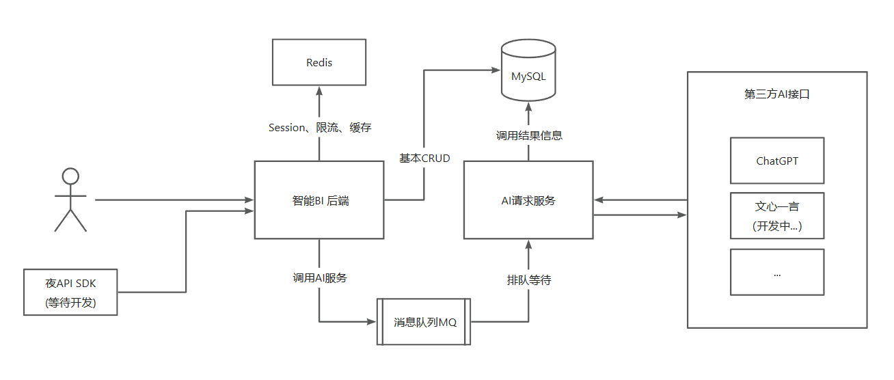
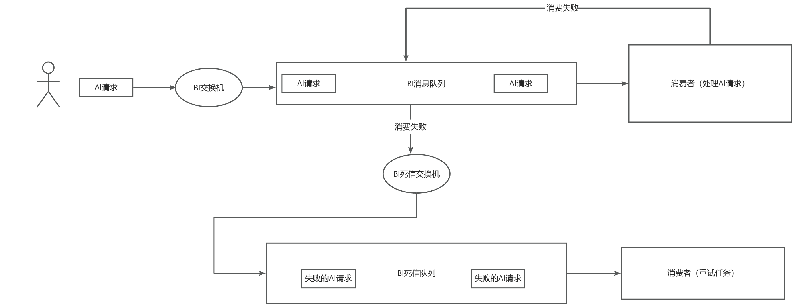
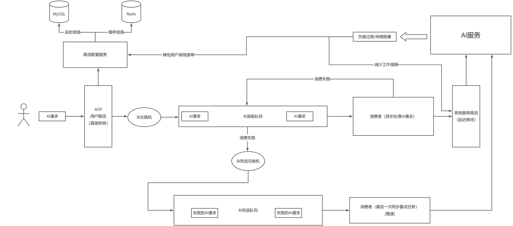
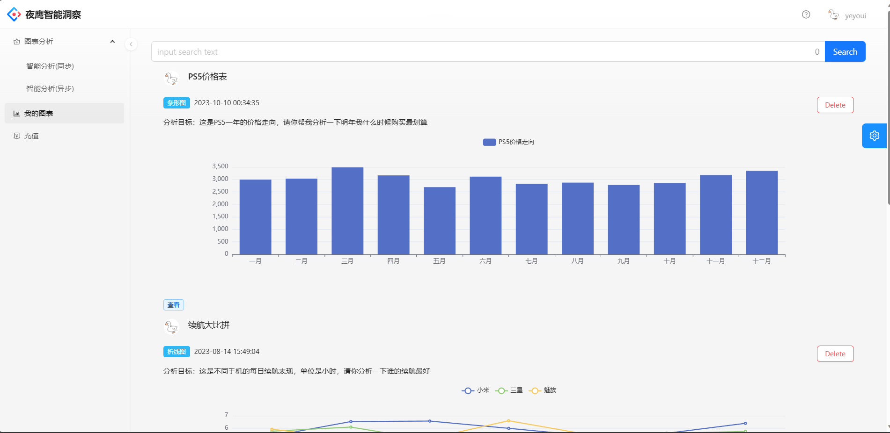
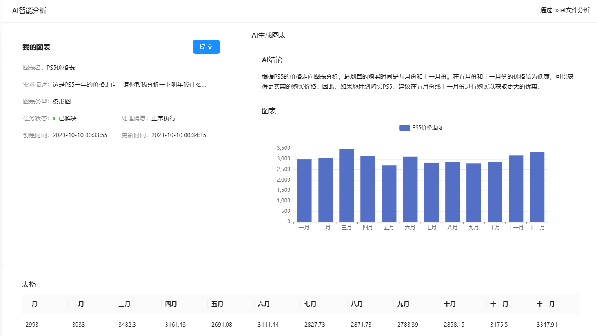
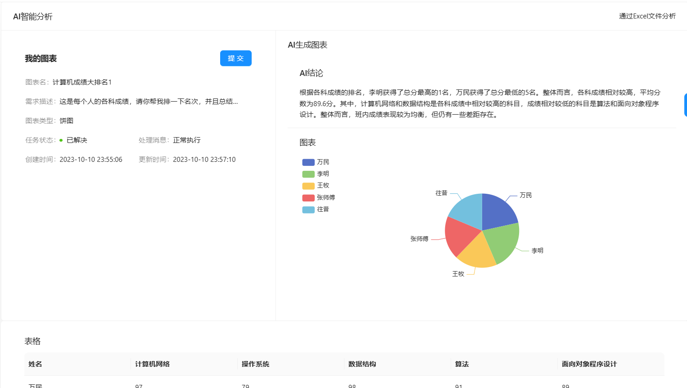

# 夜鹰智能BI平台
## 主体功能设计
> 基本业务流程

### 基本增删改查校验

...略过

## 用户Excel文件处理
### 基本流程
1. 获取请求信息并校验
2. 获取文件信息并校验
3. 通过EasyExcel对文件进行提取转化为CSV格式的字符串
4. 拼接问题并且处理格式提交给AI处理
5. 异步化处理(如下)
6. 解析AI返回信息，然后存储本次图表信息，最后返回给用户
   1. 新增一个数据库专门用于存放用户的表格信息，更加高效的提供数据查询分析服务
### *异步处理用户请求
1. 封装用户请求信息到数据库，状态默认为等待中
2. 将用户提交到任务队列中，更新状态为处理中，如果失败则设置状态为失败
3. 消费者处理任务（如下）

### *消费者处理任务
1. 通过消息队列获取ID，然后查询数据库，获取基本信息
2. 通过ID在用户图表数据库中获取数据，拼接成CSV格式的字符串
3. 提交给AI处理
4. 如果成功则设置状态为已完成,并且通过将完成消息存入Redis后，通过SSE通知用户
## 用户上传表格设计
### 格式
~~~mysql
-- 后端必须做好防sql注入
create table
(
   ${sql}
)collate = utf8mb4_unicode_ci; 
~~~
### 新增
1. 解析用户表格参数（获取字段名、数据类型，字符串长度）
   1. 通过ExcelUtils工具类来提取表头和具体内容，并且通过字符串类型判断获取类型名
2. 通过常量map对数据类型进行Java到MySQL类型的映射
3. 创建个人数据表（格式userTable_{#uid}）,然后插入全量数据
4. 根据用户的需求取出数据（挖坑
### 查询
1. 通过数据库直接得到表头字段
2. 通过图表ID获取到图表数据
3. 拼接成CSV格式字符串返回
### 详细页

## 消息队列设计
### BI请求消息

#### 发送消息
通过direct交换机直接发给对应的bi队列，采取发布确认机制
#### 处理消息
消费者通过对应的队列获取消息消费，采取手动确认机制，如果消费失败将进入死信队列处理
#### 消费失败重试机制
1. AI服务消费者拒绝消息（NACK），消息进入死信交换机，通过绑定的key交给死信队列，最后消费者执行重试，在超过重试次数则标记为失败

### 订单过期处理

### 具体实现同上（BI请求消息）
### 提交订单
1. 解析用户下单请求
2. 计算用户下单的接口价格
3. 组装订单对象，然后保存数据库
4. 将订单信息加入超时队列，如果超时则进入死信队列，统一处理订单超时
5. 执行第三方支付API
6. 返回付款码给用户
### 支付订单
1. 接受第三方支付信息的回调
2. 检查用户的付款情况
3. 更新订单状态
4. 更新数据库

## 限流设计（底层使用Redisson限流实现）

### 用户限流（AOP方式）
> 定义了注解 @RedissonRateLimit 以及AOP通知，使用时只需要在注解的属性中传入预设值即可
1. 通过AOP执行切面逻辑，在通知中利用缓存工具类中获取限流配置信息（如果不存在则向数据库获取）
2. 通过配置信息来进行限流操作

PS: 通过修改Redis缓存（短时）或者数据库的限流配置信息（永久）来更新配置
### 服务限流（依赖注入）
1. 自建线程池对任务进行管理，每次加入提交工作的时候，通过注入的Redisson限流工具类来完成限流
### 反向压力
1. 通过每次检查AI的返回信息，获取AI服务的运行情况，如果负载过高，通过修改缓存来实现短暂的限流策略调整

## 演示

主页面

详细页

异步调用

异步调用成功的详细页

积分系统

